# Portada

::: {.columns}

::: {.column width="60%"}

- **Autor:** Sebastian Carmona Estrada
- **Directora:** Prof. Dr. Eng. Olga Lucia Quintero Montoya
- **Programa:** Master in Sciences / Master in Applied Physics
- **Facultad:** School of Applied Sciences and Engineering
- **Universidad:** Universidad EAFIT
- **Grupo:** HuMath Space Systems

:::

::: {.column width="40%"}

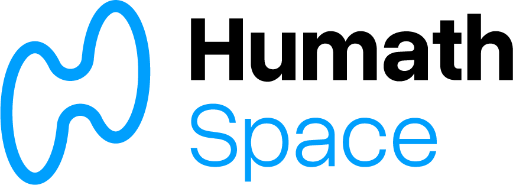{width="180"}

:::

::: 

# 1. Planteamiento del problema

## Problema central

- En 2024 Colombia registró **113.608 ha deforestadas**, con concentración crítica en el arco amazónico (IDEAM, 31-jul-2025).
- Entre enero-septiembre de 2025 en la Amazonía se estimaron **36.280 ha**, y **98 %** del fenómeno se concentró en Meta, Caquetá, Guaviare y Putumayo (MinAmbiente, 30-dic-2025).
- El mapa oficial nacional de coberturas (periodo 2020) está en **escala 1:100.000**; esta escala es útil para análisis nacionales, pero limitada para decisiones finas operativas/prediales.

<!--
Justificación para exposición (no visible en la diapositiva):
1) La magnitud y concentración territorial de la deforestación exige monitoreo más frecuente (subanual) para reacción temprana.
2) La escala 1:100.000 es adecuada para planeación macro, pero insuficiente para seguimiento detallado de frentes de cambio locales.
3) Por eso se justifica una solución de monitoreo más densa en tiempo y mayor detalle espacial desde plataformas aéreas.

Fuentes usadas:
- IDEAM (31-jul-2025): https://www.ideam.gov.co/sala-de-prensa/noticia/en-2024-colombia-consolido-la-segunda-cifra-de-deforestacion-mas-baja-en-de-la-historia
- MinAmbiente (30-dic-2025): https://www.minambiente.gov.co/amazonia-colombiana-reduce-en-25-la-deforestacion-estimada-entre-enero-y-septiembre-de-2025/
- IDEAM Coberturas 100K periodo 2020 (item info): https://visualizador.ideam.gov.co/gisserver/rest/services/Capascache/Cobertura_de_la_Tierra_100K_Periodo_2020_l%C3%ADmite_administrativo/MapServer/info/iteminfo
-->

## Brecha tecnológica en Colombia

- La nubosidad persistente reduce a menos de 5 escenas satelitales libres de nubes por mes en muchas zonas.
- La resolución de misiones gratuitas no captura variabilidad intraparcela: Landsat-8 (30 m) y Sentinel-2 (10 m).
- Las cámaras multiespectrales comerciales siguen siendo costosas (normalmente > 7000 USD).
- A nivel local no hay una solución VIS/NIR diseñada y fabricada en Colombia con costo objetivo < 1500 USD y calibración rigurosa.

## Pregunta de investigación

- ¿Cómo desarrollar y caracterizar un sistema óptico multiespectral VIS-NIR, de bajo costo y baja masa, para plataformas aéreas que opere bajo condiciones atmosféricas tropicales en Colombia?

## Hipótesis de trabajo

- Integrar una óptica VIS de 8.5 mm f/1.8 y una NIR de 8 mm f/2.5 con sensores AR0521 (VIS) y AR0522 (NIR).
- Aplicar calibración geométrica basada en ISO 12233 y calibración radiométrica mediante combinaciones de filtros caracterizadas en laboratorio.
- Con ello se espera lograr GSD <= 2 m a 5 km, error radiométrico intercanal < 5 %, costo de materiales <= 1500 USD y masa total < 2 kg.

## Objetivo general y objetivos específicos

- Objetivo general: diseñar, construir, calibrar y caracterizar un sistema óptico multiespectral VIS/NIR para integración en plataforma aérea.
- Definir la arquitectura óptica y mecánica bajo restricciones de masa, volumen, resolución y costo.
- Procurar e integrar sensores, lentes, filtros y electrónica de adquisición/almacenamiento.
- Validar desempeño en pruebas de laboratorio y de vuelo.
- Determinar respuesta geométrica y espectral para soportar productos georreferenciados de monitoreo ambiental.

## Alcance y limitaciones

- Rango espectral objetivo del sistema: 400-900 nm.
- Restricciones de integración: volumen aproximado 100 x 100 x 150 mm y masa total < 2 kg.
- Ventana operativa evaluada: 50-5000 m de altitud sobre el terreno.
- El trabajo se centra en diseño, integración y calibración del sistema; no incluye desarrollo de modelos de clasificación o estimación de variables biofísicas.

# 2. Diseño del dispositivo (Capítulo 2)

## Propósito del diseño

- Se partió de una matriz de **8 sistemas ópticos** para seleccionar la configuración VIS/NIR con mejor desempeño para la misión C3.
- El proceso combinó simulación óptica, análisis de restricciones de integración y evaluación costo-rendimiento.
- El criterio final fue técnico-operativo: resolución suficiente, cobertura útil, bajo consumo y factibilidad de fabricación local.

## Requerimientos ópticos y criterios de diseño

- Resolución espacial objetivo: **MTF >= 40 lp/mm** al 30 % de contraste.
- Cobertura: campo de visión útil para misiones entre **50 m y 5000 m AGL**.
- Restricciones de integración C3: masa, volumen, autonomía y costo.
- Condición de operación: iluminación ambiental diurna.

| Parámetro | Requisito de diseño |
|---|---|
| Masa del payload | <= 2 kg |
| Dimensiones máximas | 100 x 100 x 150 mm |
| Tiempo de misión | <= 3 h |
| MTF (30 % contraste) | >= 40 lp/mm |
| Resolución @ 50 m | <= 7.35 cm |
| Resolución @ 1000 m | <= 1.47 m |
| Resolución @ 5000 m | <= 7.35 m |
| Presupuesto objetivo | <= 1500 USD |

## Terminología usada en el diseño óptico

| Término | Significado práctico |
|---|---|
| MTF | Capacidad de preservar contraste en detalle fino; se usa 30 % como punto de comparación. |
| AFOV | Campo angular de visión; mayor AFOV implica más cobertura por imagen. |
| FOV | Cobertura lineal en tierra para una altura dada. |
| Distancia focal | Controla aumento y cobertura; focal larga mejora detalle y reduce cobertura. |
| Apertura (f/#) | Controla entrada de luz y desempeño en frecuencias espaciales altas. |

## Plataforma de adquisición y procesamiento

- Núcleo de procesamiento: **Raspberry Pi 4B (8 GB)** por costo, modularidad y ecosistema de software.
- Cámaras Alvium conectadas por USB 3 con stack en Python para adquisición y control.
- Se descartó GPU dedicada (Jetson) en esta versión por consumo, costo y complejidad.
- Arquitectura preparada para migrar a inferencia en borde en iteraciones futuras.

::: {.columns}
::: {.column width="55%"}
- Filosofía de diseño: plug-and-play, mantenible y replicable.
- Integración directa VIS/NIR + georreferenciación.
:::
::: {.column width="45%"}
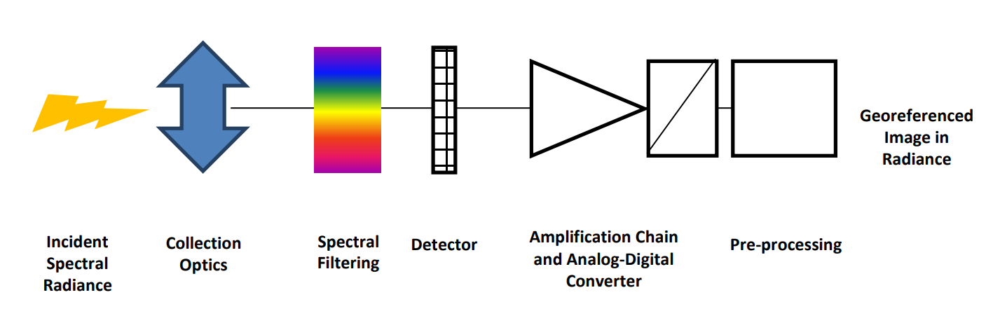{width="100%"}
:::
:::

## Matriz de objetivos candidatos (8 sistemas)

| Sistema | Objetivo | Focal [mm] | AFOV [deg] | Apertura | MTF@30% [lp/mm] | Peso [g] |
|---|---|---|---|---|---|---|
| 1 | 16 mm HPr (EO) | 16 | 42.2 | f/16 | 62 | 138 |
| 2 | 50 mm HPr (EO) | 50 | 10.1 | f/2.8 | 180 | -- |
| 3 | 25 mm HPr (EO) | 25 | 27.8 | f/1.8 | 40 | 78 |
| 4 | 16 mm HPr (EO) | 16 | 42.2 | f/1.8 | 128 | 138 |
| 5 | 4 mm Basler | 4 | 109.0 | f/1.8 | -- | -- |
| 6 | 8 mm HEO NIR (EO) | 8 | 29.9 | f/2.5 | 120 | 4 |
| 7 | 8.5 mm Cr (EO) | 8.5 | 28.2 | f/1.8 | 85 | 60 |
| 8 | 12.5 mm Rugged Blue (EO) | 12.5 | 19.4 | f/2.5 | 150 | 5 |

## Lectura técnica de la matriz de objetivos

- **Sistema 2**: máxima nitidez teórica (MTF alta), pero AFOV muy estrecho.
- **Sistema 5**: cobertura extrema, pero sin curva MTF reportada por fabricante.
- **Sistemas 6 y 7**: compromiso robusto entre AFOV, MTF, masa y costo.
- En régimen aéreo (hiperfoco), la profundidad de campo deja de ser limitante; domina el balance apertura-peso-costo.

## Preselección de sensores de imagen

- Parámetros evaluados: resolución, tamaño de píxel, tipo de obturación, bits, masa y consumo.
- AR0521/AR0522 fueron priorizados por **consumo bajo (~2.2 W)** y costo.
- Se asumió rolling shutter como compromiso frente a global shutter por restricciones del proyecto.

| Sistema | Sensor | H x V [px] | Pixel [um] | Shutter | Bits | Peso [g] | Potencia [W] |
|---|---|---|---|---|---|---|---|
| 1,3,4 | Alvium U-2040 (IMX541) | 4512 x 4512 | 2.74 | Global | 12 | 65 | 3.9 |
| 2 | Alvium U-2050 (IMX183) | 5496 x 3672 | 2.40 | Rolling | 10 | 65 | 3.2 |
| 5 | Basler acA1920 (IMX249) | 1920 x 1200 | 5.86 | Global | 12 | 90 | 3.9 |
| 6 | Alvium U-501m (AR0522) | 2592 x 1944 | 2.20 | Rolling | 10 | 65 | 2.2 |
| 7,8 | Alvium U-500c (AR0521) | 2592 x 1944 | 2.20 | Rolling | 10 | 60 | 2.2 |

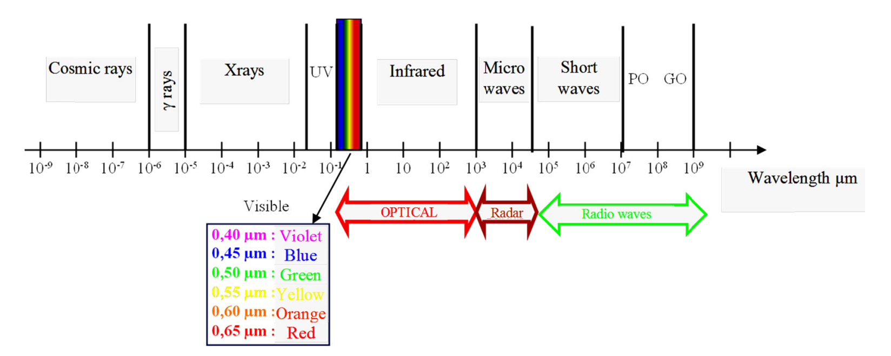{width="70%"}

## Modelo teórico: FOV y resolución en tierra

$$
AFOV = 2\tan^{-1}\left(\frac{H_{sensor}}{2f}\right)
$$

$$
FOV = 2 \cdot WD \cdot \tan\left(\frac{AFOV}{2}\right), \quad PMAG=\frac{H_{sensor}}{FOV}
$$

$$
f_{obj}=f_{im}\cdot PMAG,\quad f_{sensor}=\frac{1}{2s}
$$

$$
\Delta_{ground}=\frac{1}{2f_{obj}}\cdot\frac{1}{1000},\quad
\Delta_{pix}=\frac{1}{2f_{sensor}}\cdot\frac{1}{1000}
$$

- Se evaluaron altitudes de **50 m, 1000 m y 5000 m** para los 8 sistemas.

## Resultados teóricos por altitud (sistemas finalistas)

| Altitud | FOV Sys.6 (NIR) | $\Delta_{MTF}$ Sys.6 | FOV Sys.7 (VIS) | $\Delta_{MTF}$ Sys.7 |
|---|---|---|---|---|
| 50 m | 26.73 m | 1.9 cm | 25.16 m | 3.4 cm |
| 1000 m | 534.6 m | 39.1 cm | 503.2 m | 69.2 cm |
| 5000 m | 2673 m | 1.95 m | 2516 m | 3.46 m |

| Sistema | FOV @ 5000 m | $\Delta_{MTF}$ @ 5000 m | Lectura de diseño |
|---|---|---|---|
| 2 | 881 m | 0.186 m | Muy alta resolución, baja cobertura |
| 4 | 3863 m | 1.221 m | Buen compromiso técnico, costo alto |
| 6 | 2673 m | 1.953 m | Balance costo-masa-resolución |
| 7 | 2516 m | 3.460 m | Complemento VIS para fusión multicanal |

## Tendencias obtenidas en la simulación

::: {.columns}
::: {.column width="50%"}
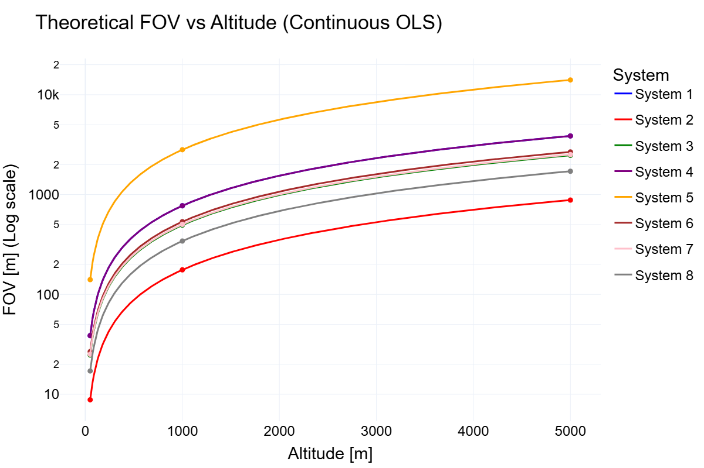{width="100%"}
:::
::: {.column width="50%"}
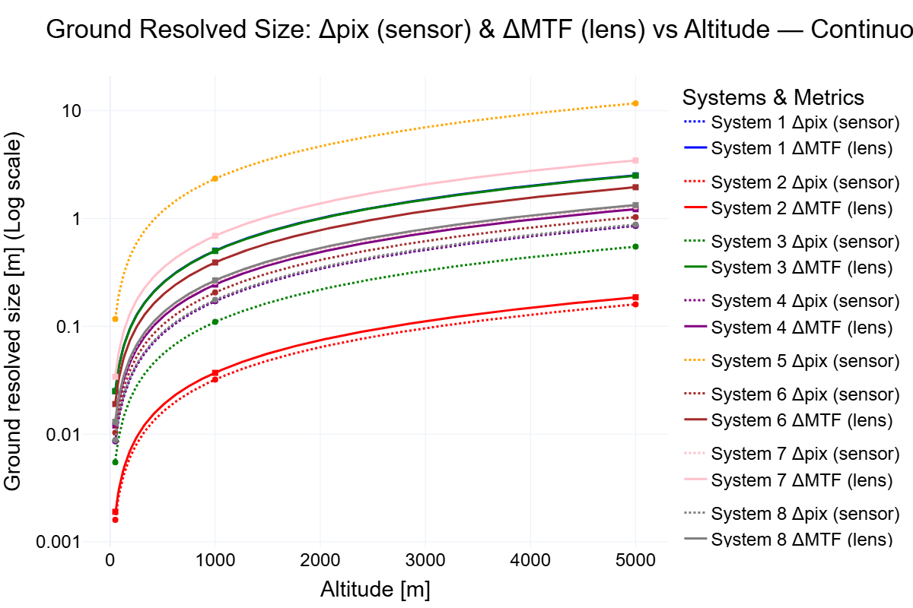{width="100%"}
:::
:::

- En todos los casos: $\Delta_{MTF} > \Delta_{pix}$, por limitación óptica sobre el límite de muestreo del sensor.
- Focal larga: más nitidez y menos cobertura.
- Focal corta: más cobertura y menos nitidez.
- La pareja 6-7 mantiene geometría similar, favoreciendo el registro VIS/NIR.

## Selección final y justificación de diseño

- Selección final: **Sistema 6 (NIR) + Sistema 7 (VIS)**.
- Cumple simultáneamente cobertura, costo, masa y consumo para misión C3.
- Permite integración multiespectral con desalineamiento reducido entre canales.
- Define la línea base para procura, construcción e integración del capítulo siguiente.

| Canal | Sistema final | Lente | Sensor | Costo aproximado (sensor+lente) |
|---|---|---|---|---|
| NIR | 6 | 8 mm f/2.5 | AR0522 | 541 USD |
| VIS | 7 | 8.5 mm f/1.8 | AR0521 | 777 USD |

| Indicador global | Resultado |
|---|---|
| Masa de payload (meta <= 2 kg) | Factible |
| Presupuesto óptico (meta <= 1500 USD) | Cumplido |
| Ventana operativa 50-5000 m | Cumplida |

# 3. Procura y construcción del dispositivo (Capítulo 3)

## Procura de componentes y estrategia de integración

- La procura priorizó componentes disponibles comercialmente, costo controlado y compatibilidad mecánica.
- Se articuló una estrategia colaborativa EAFIT-KTH para integrar plataforma aérea y payload.
- La financiación de componentes ópticos/electrónicos se apalancó desde el proyecto 4DAir.
- La fabricación e integración se ejecutó con enfoque iterativo para reducir riesgo técnico.

| Sub-sistema | Decisión técnica | Razón principal |
|---|---|---|
| Cámara VIS | Alvium U-500c + 8.5 mm | Balance resolución/costo |
| Cámara NIR | Alvium U-501m + 8 mm | Cobertura NIR y bajo peso |
| Cómputo | Raspberry Pi 4 | Integración simple y robusta |
| Carcasa | PET-G impreso 3D | Resistencia y manufactura local |

## Construcción de sistemas ópticos VIS y NIR

- Sistema NIR: U-501m + lente 8 mm f/2.5 + filtro pasabanda 850 nm.
- Sistema VIS: U-500c + lente 8.5 mm + filtro UV/IR cut para aislar visible.
- Diseño modular para facilitar mantenimiento, reemplazo y ajuste.
- Conexión USB directa a la unidad de adquisición para simplificar cableado.

| Canal | Sensor | Lente | Filtro | Resolución nativa |
|---|---|---|---|---|
| VIS | Alvium U-500c (AR0521) | 8.5 mm f/1.3 | UV/IR-cut (370-750 nm) | 2592 x 1944 |
| NIR | Alvium U-501m (AR0522) | 8 mm f/2.5 | BP 850 nm (FWHM 50 nm) | 2592 x 1944 |

## CAD y ensamblaje mecánico del prototipo

- El encapsulado se desarrolló en PET-G por su rigidez, resistencia y estabilidad térmica.
- Integración mecánica dentro de la bahía del C3 sin rediseño estructural de aeronave.
- Masa final del dispositivo: 1810 g (dentro del requisito <= 2 kg).
- Arquitectura interna: módulo VIS, módulo NIR, cómputo, energía y sensado auxiliar.

| Parámetro mecánico | Valor |
|---|---|
| Material de carcasa | PET-G |
| Masa final del payload | 1810 g |
| Restricción de masa | <= 2 kg |
| Volumen objetivo | 100 x 100 x 150 mm |

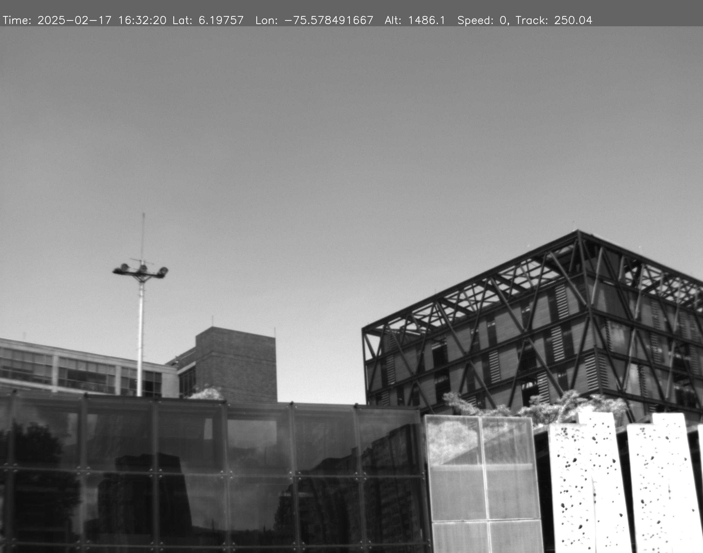{width="74%"}

## Sistema de adquisición y control

- Se implementó un flujo productor-consumidor para adquisición paralela de cámaras.
- El pipeline integra captura, mosaico VIS/NIR, superposición de telemetría y guardado.
- El sistema soporta captura de imagen fija y video durante operación en tierra o vuelo.
- Rendimiento operativo reportado: hasta 24 FPS con registro de metadatos.

| Comando | Función |
|---|---|
| `s` | Captura imagen (JPEG) |
| `v` | Inicia/detiene grabación (AVI) |
| `Enter` | Cierre controlado del script |

## Script de operación, configuración GNSS y sincronización de datos

- Servicio de arranque para configuración determinística GNSS en cada boot.
- Ajuste de enlace serie y perfiles NMEA para georreferenciación estable.
- Servicio de sincronización automática a nube para respaldo de videos.
- Diseño orientado a operación autónoma y tolerancia a fallos.

::: {.columns}
::: {.column width="50%"}
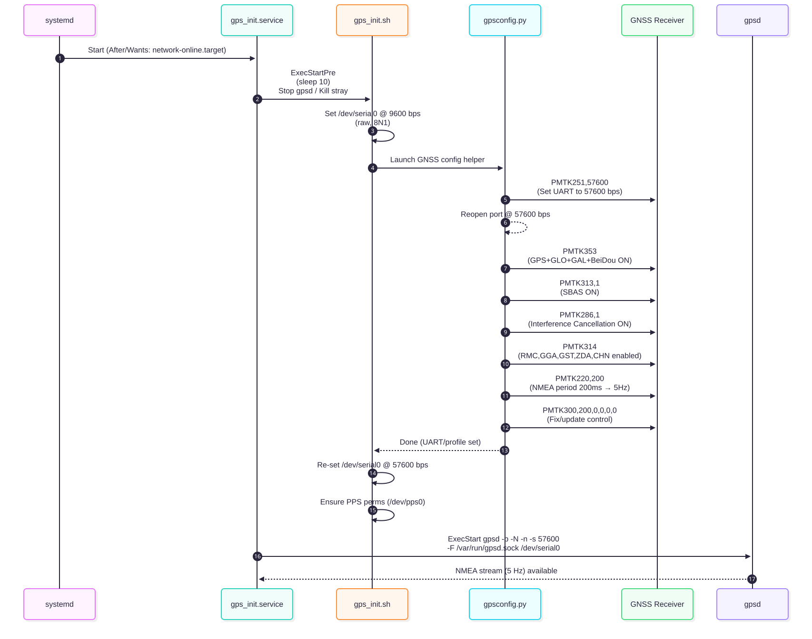{width="100%"}
:::
::: {.column width="50%"}
{width="100%"}
:::
:::

## Operación remota del dispositivo QBee

- Acceso remoto en red local mediante VNC.
- Acceso remoto global mediante Raspberry Pi Connect.
- Supervisión de captura y telemetría en tiempo real desde dispositivos externos.
- Actualización continua de software vía repositorio privado y despliegue remoto.

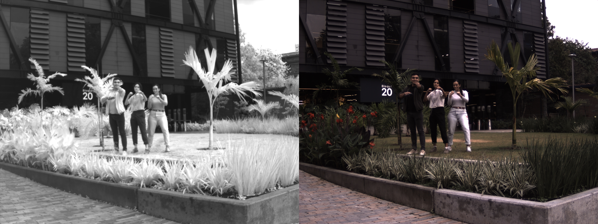{width="76%"}

# 4. Pruebas en campo (Capítulo 3)

## Pruebas en tierra

- Validación funcional en condiciones controladas antes de cada campaña aérea.
- Verificación de inicio automático, captura de imagen, grabación de video y estabilidad.
- Pruebas con fuente directa y batería interna del dispositivo.
- Confirmación de operación simultánea de canales VIS/NIR y overlay GPS.

::: {.columns}
::: {.column width="50%"}
{width="100%"}
:::
::: {.column width="50%"}
{width="100%"}
:::
:::

## Pruebas en condiciones extremas de superficie

- Se ejecutaron pruebas durante campaña antártica (dic 2024 - mar 2025).
- Rango térmico de operación probado cercano a -6 C a 2 C.
- Se observaron fallos intermitentes de arranque y de inicio de grabación.
- Aun así, se obtuvieron capturas válidas que confirmaron viabilidad con mejoras térmicas.

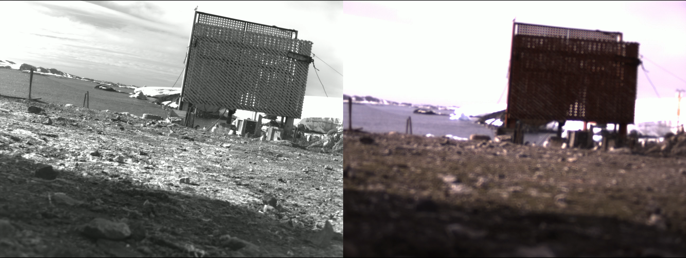{width="78%"}

## Pruebas de vuelo

- Vuelo 1: Cessna 208 Caravan (~5000 ft), operación estable y monitoreo remoto.
- Vuelo 2: T-27 Tucano, operación autónoma bajo maniobras de hasta 4g.
- No se reportaron caídas de adquisición durante los ensayos.
- Se identificó sensibilidad de desempeño a condiciones de iluminación al atardecer.

::: {.columns}
::: {.column width="50%"}
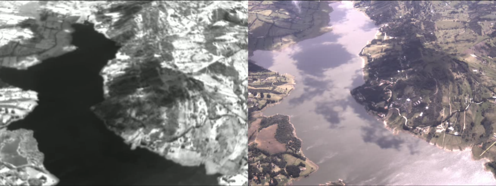{width="100%"}
:::
::: {.column width="50%"}
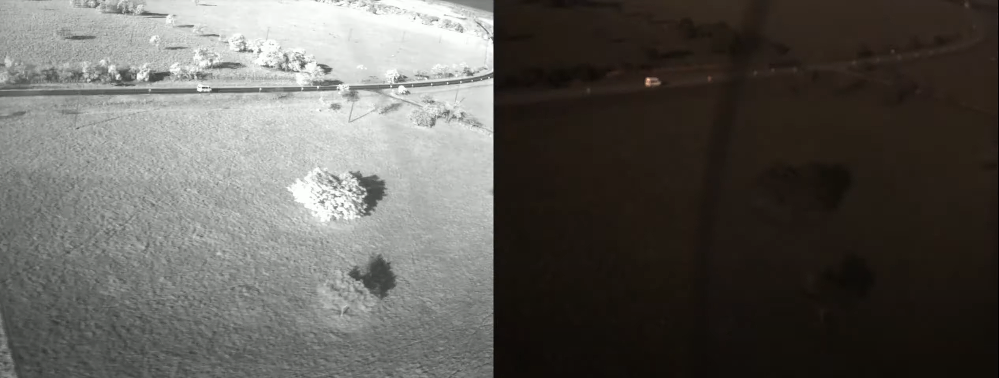{width="100%"}
:::
:::

## Hallazgos operativos y lecciones aprendidas

- El sistema demostró robustez mecánica y funcional en escenarios reales.
- Factores críticos detectados: temperatura, saturación radiométrica y enfoque óptico.
- El software multihilo fue estable por más de 30 horas continuas.
- Se recomienda incorporar aislamiento térmico, control de saturación y watchdog de servicios.

| Escenario | Resultado observado | Acción recomendada |
|---|---|---|
| Tierra (diurno) | Operación estable | Mantener protocolo actual |
| Frío extremo | Fallos intermitentes | Aislamiento y preheating |
| Vuelo con maniobras | Estable hasta 4g | Validar con más campañas |
| Atardecer/baja luz | Degradación VIS | Ajuste dinámico de exposición |

# 5. Trabajo de laboratorio y caracterización óptica (Capítulo 4)

## Alcance técnico del capítulo

- La validación experimental se divide en dos bloques: **geométrico** (FOV, AFOV, MTF, GRD) y **espectral** (respuesta relativa VIS/NIR).
- El objetivo es cerrar la trazabilidad desde diseño teórico hasta desempeño medido bajo protocolo de laboratorio.
- Se reportan ecuaciones, configuración de adquisición, control de incertidumbre y discrepancias frente a teoría.

| Bloque | Variable principal | Método aplicado |
|---|---|---|
| Geométrico | FOV/AFOV | ISO 12233 + ajuste Deming |
| Geométrico | MTF/GRD | Slanted-edge (ESF->LSF->FFT) |
| Espectral | Sensibilidad relativa | Barrido de filtros y combinaciones |

## Modelo geométrico y ajuste experimental

$$
AFOV = 2 \tan^{-1}\left(\frac{H}{2f}\right),\quad
FOV(d)=2d\tan\left(\frac{AFOV}{2}\right)
$$

$$
FOV = \beta_1\cdot WD + \beta_0
$$

- El ajuste FOV-WD se hizo con **regresión Deming** para incorporar error en ambas variables.
- Incertidumbre instrumental usada: orden de 1 mm en distancias de medición.
- Se midieron componentes horizontales y verticales para VIS (Sistema 7) y NIR (Sistema 6).

## Datos medidos de FOV (base experimental)

| Test | NIR WD_H [m] | NIR FOV_H [m] | NIR WD_V [m] | NIR FOV_V [m] | VIS WD_H [m] | VIS FOV_H [m] | VIS WD_V [m] | VIS FOV_V [m] |
|---|---|---|---|---|---|---|---|---|
| 1 | 0.071 | 0.035 | 0.087 | 0.035 | 0.092 | 0.035 | 0.107 | 0.035 |
| 2 | 0.331 | 0.231 | 0.350 | 0.180 | 0.379 | 0.239 | 0.303 | 0.138 |
| 3 | 0.650 | 0.468 | 0.650 | 0.349 | 0.694 | 0.458 | 0.700 | 0.342 |

## Ecuaciones ajustadas FOV-WD (Deming)

| Caso | Modelo |
|---|---|
| VIS-H | $FOV=(0.7025\pm0.0045)\,WD-(0.0288\pm0.0021)$ |
| VIS-V | $FOV=(0.5171\pm0.0029)\,WD-(0.0197\pm0.0013)$ |
| NIR-H | $FOV=(0.7477\pm0.0031)\,WD-(0.0175\pm0.0013)$ |
| NIR-V | $FOV=(0.5579\pm0.0034)\,WD-(0.0141\pm0.0015)$ |

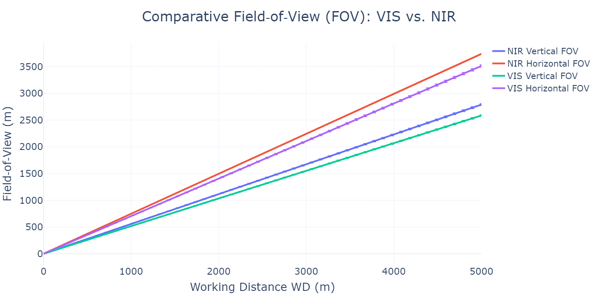{width="88%"}

## Validación en altitudes de misión (predicción vs teoría)

| Altitud | VIS Pred H [m] | VIS Theo H [m] | VIS Pred V [m] | VIS Theo V [m] | NIR Pred H [m] | NIR Theo H [m] | NIR Pred V [m] | NIR Theo V [m] |
|---|---|---|---|---|---|---|---|---|
| 50 m | 35.10 | 33.54 | 25.84 | 25.16 | 37.37 | 35.64 | 27.88 | 26.73 |
| 1000 m | 702.50 | 670.87 | 517.08 | 503.15 | 747.70 | 712.80 | 557.90 | 534.60 |
| 5000 m | 3512.00 | 3354.35 | 2585.48 | 2515.76 | 3737.00 | 3564.00 | 2788.89 | 2673.00 |

- Error absoluto crece con altitud.
- Error relativo se mantiene casi constante, sugiriendo sesgo geométrico sistemático (distorsión/paralaje residual).

::: {.columns}
::: {.column width="50%"}
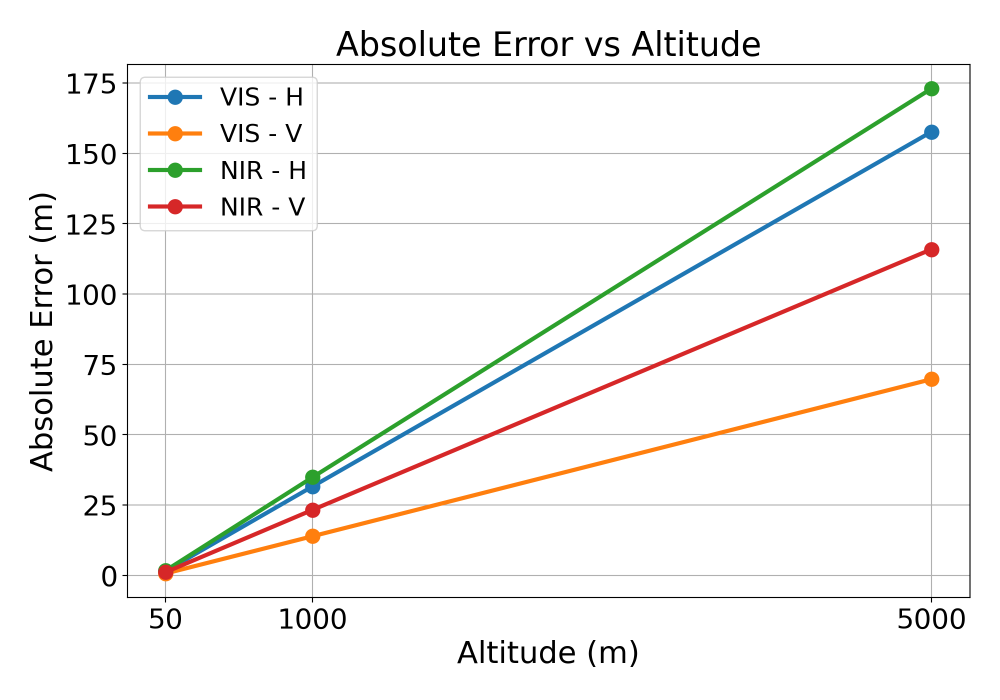{width="100%"}
:::
::: {.column width="50%"}
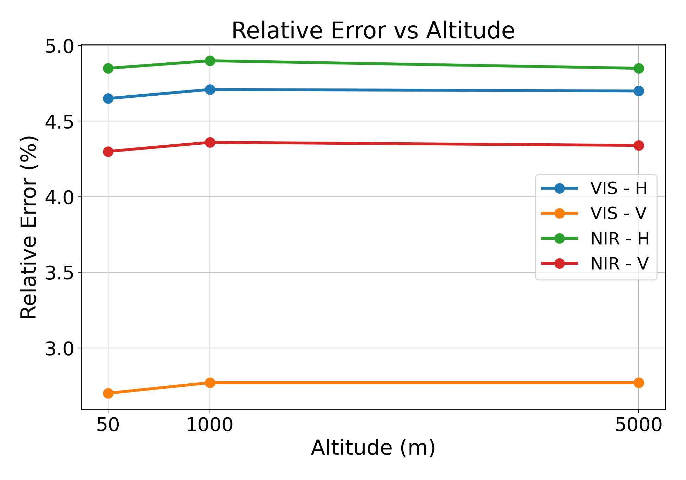{width="100%"}
:::
:::

## AFOV experimental vs AFOV teórico

$$
AFOV_{exp}=2\arctan\left(\frac{FOV}{2\,WD}\right),\quad
\Delta_{rel}=\frac{|AFOV_{exp}-AFOV_{teo}|}{AFOV_{teo}}\times 100\%
$$

| Caso (WD máximo) | AFOV exp [deg] | AFOV teórico [deg] | Error relativo |
|---|---|---|---|
| VIS-H | 36.52 | 37.10 | 1.6 % |
| VIS-V | 27.46 | 28.24 | 2.8 % |
| NIR-H | 39.60 | 39.30 | 0.8 % |
| NIR-V | 30.05 | 29.93 | 0.4 % |

::: {.columns}
::: {.column width="50%"}
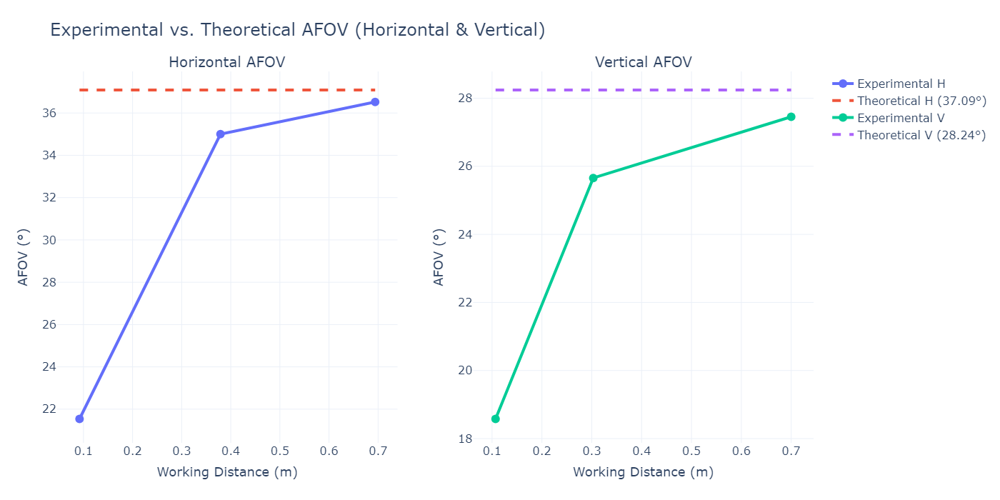{width="100%"}
:::
::: {.column width="50%"}
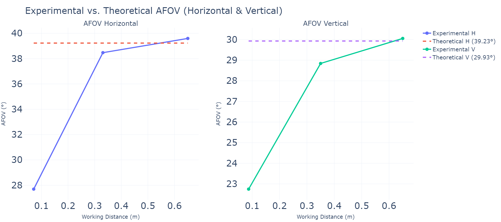{width="100%"}
:::
:::

## Magnificación primaria PMAG

| Altitud | PMAG VIS (Sys.7) | PMAG NIR (Sys.6) |
|---|---|---|
| 50 m | $1.62\times10^{-4}$ | $1.53\times10^{-4}$ |
| 1000 m | $8.12\times10^{-6}$ | $7.63\times10^{-6}$ |
| 5000 m | $1.62\times10^{-6}$ | $1.53\times10^{-6}$ |

- Diferencia VIS-NIR < 6 %, favorable para co-registro multiespectral.

## Fundamento MTF y criterio de resolución

$$
g(x,y)=f(x,y)*h(x,y),\quad
LSF(x)=\frac{d}{dx}ESF(x),\quad
MTF(u)=\left|\mathcal{F}\{LSF(x)\}\right|
$$

$$
MTF(f_{im})=0.30
$$

- Se usa corte al 30 % como compromiso entre contraste útil y piso de ruido.
- Este corte se convierte a resolución en terreno (GRD) usando PMAG.

## Control de calidad MTF: limitación y mitigación experimental

- La carta ISO 12233 impresa en mate mostró histograma no ideal (picos espurios y dispersión).
- Se adoptó patrón empírico de borde inclinado con ROI 104 x 104 px.
- Se aplicó corrección de dark current y promedio de múltiples capturas para estabilizar ESF/LSF.

::: {.columns}
::: {.column width="33%"}
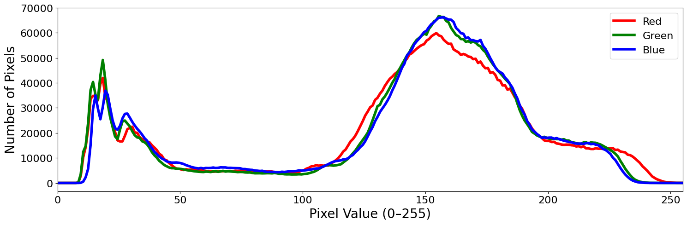{width="100%"}
:::
::: {.column width="33%"}
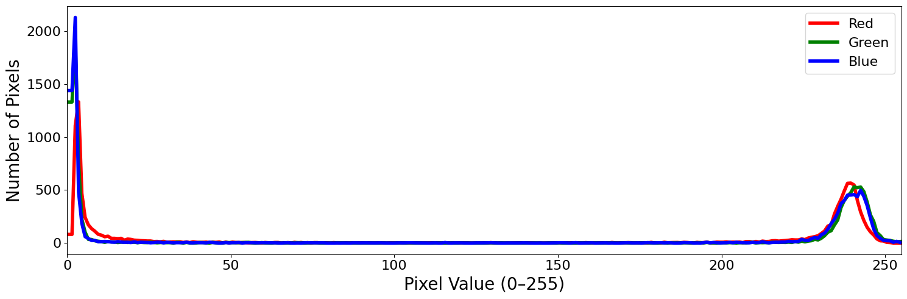{width="100%"}
:::
::: {.column width="33%"}
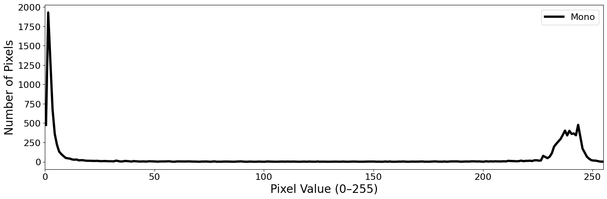{width="100%"}
:::
:::

## Resultados MTF y MTFA

$$
MTFA=\int_0^{f_c}MTF(f)\,df
$$

::: {.columns}
::: {.column width="50%"}
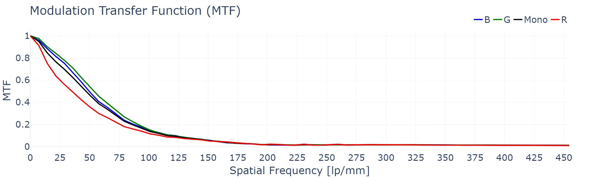{width="100%"}
:::
::: {.column width="50%"}
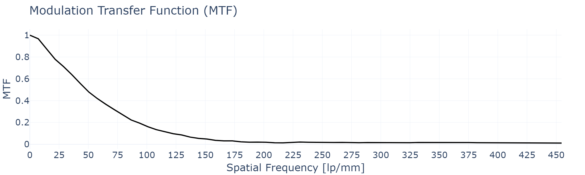{width="100%"}
:::
:::

| Sistema/Canal | $f_c$ [lp/mm] | MTFA [lp/mm] |
|---|---|---|
| VIS-R | 57.72 | 34.45 |
| VIS-G | 79.36 | 49.58 |
| VIS-B | 72.15 | 47.25 |
| VIS-Mono | 72.15 | 45.05 |
| NIR-Mono | 79.36 | 46.48 |

## Frecuencia de corte medida vs especificación

| Sistema/Canal | $f_{im,meas}$ [lp/mm] | $f_{im,theo}$ [lp/mm] | $\Delta$ [%] |
|---|---|---|---|
| VIS-R | 57.72 | 85 | -32.1 |
| VIS-G | 79.36 | 85 | -6.6 |
| VIS-B | 72.15 | 85 | -15.1 |
| VIS-Mono | 72.15 | 85 | -15.1 |
| NIR-Mono | 79.36 | 120 | -33.9 |

- VIS: canal G con mejor transferencia (consistente con enfoque y aberración cromática longitudinal).
- NIR: desviación grande frente a hoja de datos teórica, pero con desempeño real útil y estable.

## GRD derivada de MTF

| Sistema | Canal | GRD @50 m [cm] | GRD @1000 m [cm] | GRD @5000 m [cm] | GRD @5000 m [m] |
|---|---|---|---|---|---|
| VIS | R | 5.35 | 106.68 | 534.72 | 5.35 |
| VIS | G | 3.89 | 77.59 | 388.91 | 3.89 |
| VIS | B | 4.28 | 85.34 | 427.78 | 4.28 |
| VIS | Mono | 4.28 | 85.34 | 427.78 | 4.28 |
| NIR | Mono | 4.12 | 82.57 | 411.79 | 4.12 |

| Sistema/Canal | Altitud | GRD teórica [cm] | GRD experimental [cm] | Discrepancia |
|---|---|---|---|---|
| VIS-Mono | 50 m | 3.40 | 4.28 | +25.9 % |
| VIS-Mono | 1000 m | 69.20 | 85.34 | +23.3 % |
| VIS-Mono | 5000 m | 346.00 | 427.78 | +23.6 % |
| NIR-Mono | 50 m | 1.90 | 4.12 | +116.8 % |
| NIR-Mono | 1000 m | 39.10 | 82.57 | +111.2 % |
| NIR-Mono | 5000 m | 195.30 | 411.79 | +110.8 % |

## Lectura crítica de resultados geométricos

- VIS presenta desviación estable ~23-26 % respecto a modelo ideal.
- NIR presenta desviación >100 % contra teórico de fabricante, pero GRD real cercana a VIS.
- Conclusión técnica: el NIR no falla operativamente; el baseline teórico parece sobreestimado.

## Marco radiométrico para bloque espectral

$$
Q_d(\theta,\lambda)=\frac{\pi}{4(F/\#)^2}\,O_e(\lambda)\,\Delta\lambda\,L(\lambda)\,\tau\,\cos^4\theta
$$

$$
C\propto \int S(\lambda)\,L(\lambda)\,d\lambda,\quad
R(\lambda_0)=\sum_{x,y}I_{filt}(x,y;\lambda_0)
$$

- La tesis entrega respuesta espectral **relativa** (sin calibración absoluta trazable).

## Procedimiento espectral de laboratorio

- Fuente: tungsteno ThorLabs OSL-2, validada con minispectrómetro Newport.
- Colimación: lente plano-convexa 25 mm y maximización de potencia en detector.
- Corrección de dark current del minispectrómetro: media 3513.97 counts.
- Impacto de offset sin corregir: ~6.4 % del fondo de escala del equipo.

::: {.columns}
::: {.column width="50%"}
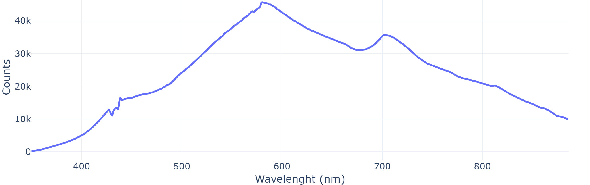{width="100%"}
:::
::: {.column width="50%"}
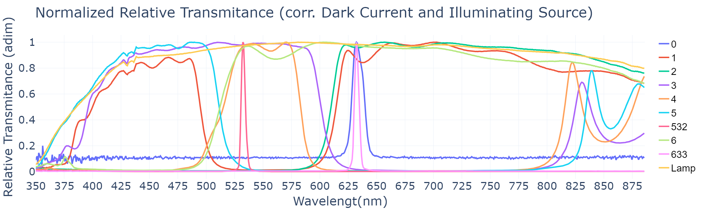{width="100%"}
:::
:::

## Diseño de bandas: combinaciones de filtros

- Se evaluaron combinaciones de 1, 2 y 3 elementos: **987 combinaciones**.
- Curvas objetivo gaussianas en 10 centros espectrales (VIS + NIR).
- Métrica de selección: correlación de Pearson entre curva ideal y curva compuesta.
- Se combinó criterio numérico con validación experimental de transmitancia útil.

::: {.columns}
::: {.column width="50%"}
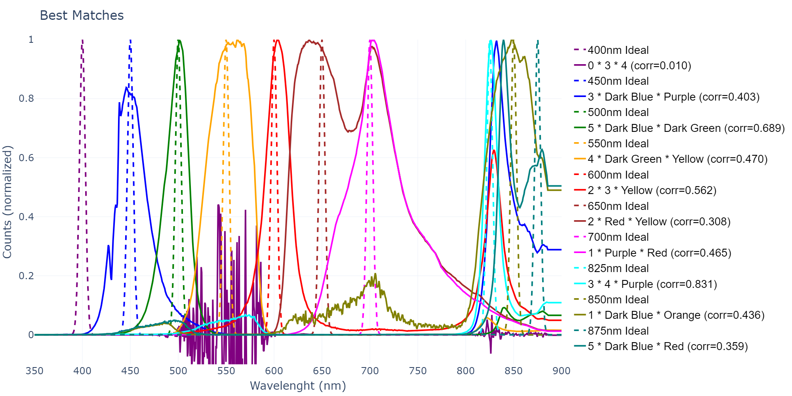{width="100%"}
:::
::: {.column width="50%"}
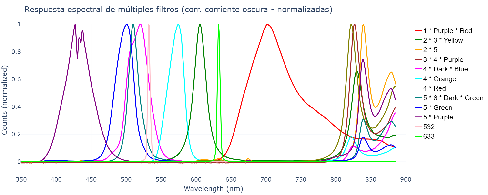{width="100%"}
:::
:::

## Longitud de onda central y FWHM (filtros finales)

| Combinación | $\lambda_c$ [nm] | FWHM [nm] |
|---|---|---|
| 5 x Purple | 427.07 | 42.55 |
| 5 x Green | 501.15 | 30.24 |
| 5 x 6 x Dark Green | 509.78 | 17.57 |
| 4 x Dark Blue | 520.59 | 35.72 |
| 532 nm | 532.16 | 4.59 |
| 4 x Orange | 574.43 | 26.73 |
| 2 x 3 x Yellow | 605.39 | 20.21 |
| 633 nm | 632.19 | 5.05 |
| 1 x Purple x Red | 701.89 | 77.16 |
| 4 x Red | 822.38 | 20.19 |
| 3 x 4 x Purple | 826.43 | 18.98 |
| 2 x 5 | 839.43 | 17.14 |

## Normalización de irradiancia por potencia óptica

| Combinación | Potencia [mW] |
|---|---|
| 5 x Purple | 70.4 |
| 1 x Purple x Red | 68.1 |
| 5 x Green | 53.3 |
| 4 x Orange | 43.1 |
| 2 x 3 x Yellow | 36.8 |
| 4 x Red | 26.5 |
| 2 x 5 | 26.2 |
| 4 x Dark Blue | 23.7 |
| 5 x 6 x Dark Green | 17.9 |
| 3 x 4 x Purple | 9.7 |
| 633 nm | 1.47 |
| 532 nm | 0.42 |

- Referencia de irradiancia en adquisición: **0.42 mW**.
- El resto de combinaciones se atenuó para igualar ese nivel.

## Configuración de captura para respuesta espectral

| Parámetro común | VIS | NIR |
|---|---|---|
| Gain | 0.0 | 0.0 |
| Gamma | 1.0 | 1.0 |
| Hue | 0.0 | -- |
| Height [px] | 714 | 600 |
| Width [px] | 760 | 600 |
| OffsetX [px] | 900 | 1026 |
| OffsetY [px] | 600 | 650 |
| BalanceRatio_Red | 0.999 | -- |
| BalanceRatio_Blue | 0.999 | -- |

| Sistema | Filtro | ExposureTime [ms] |
|---|---|---|
| VIS | 1 x Purple x Red | 2859.217 |
| VIS | 2 x 3 x Yellow | 2916.174 |
| VIS | 3 x 4 x Purple | 11.391 |
| VIS | 4 x Dark Blue | 3998.348 |
| VIS | 4 x Orange | 888.522 |
| VIS | 5 x 6 x Dark Green | 5661.478 |
| VIS | 5 x Purple | 47000.520 |
| VIS | 5 x Green | 2870.609 |
| NIR | 4 x Red | 29.372 |
| NIR | 3 x 4 x Purple | 36.715 |
| NIR | 2 x 5 | 29.372 |

## Dark current, repetibilidad y clipping

- Por configuración: 50 frames iluminados + 50 dark frames.
- Corrección por sustracción de dark master y promedio para reducir ruido aleatorio.
- En NIR, estadísticos dark permanecen bajos (media/varianza ~1e-3, máximo 1 count).
- Se verificó ausencia de saturación con análisis de cuantiles ($q_{99.9}<255$ en 8 bits).

::: {.columns}
::: {.column width="50%"}
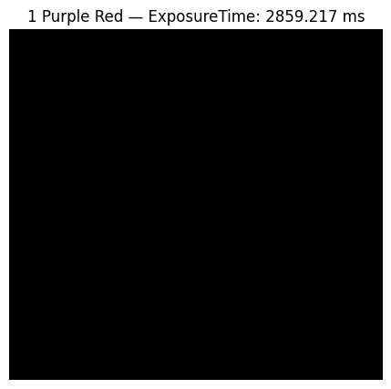{width="100%"}
:::
::: {.column width="50%"}
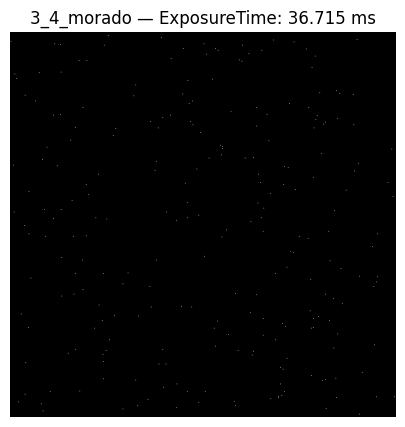{width="100%"}
:::
:::

::: {.columns}
::: {.column width="50%"}
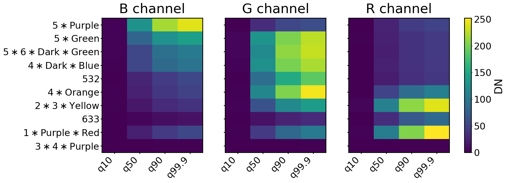{width="100%"}
:::
::: {.column width="50%"}
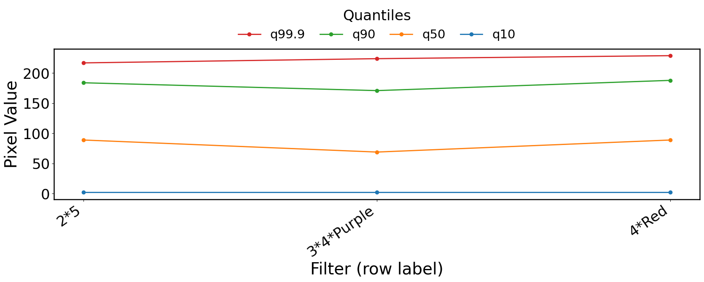{width="100%"}
:::
:::

## Respuesta espectral relativa final

- VIS presenta la estructura esperada de tres lóbulos (B-G-R) coherente con sensor Bayer.
- NIR presenta respuesta unimodal dentro de 820-840 nm.
- En NIR, la dispersión entre puntos fue baja (CV ~5.5 %) bajo irradiancia controlada.
- Limitación metodológica: respuesta integrada por banda (no estimación absoluta puntual).

::: {.columns}
::: {.column width="50%"}
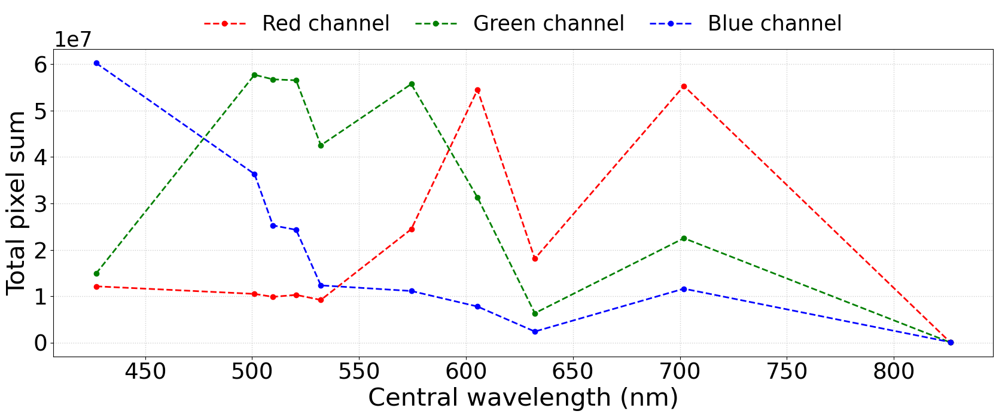{width="100%"}
:::
::: {.column width="50%"}
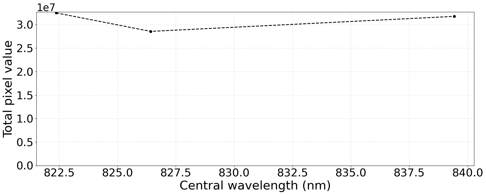{width="100%"}
:::
:::

## Cierre de requisitos del capítulo

| Requisito | Meta | Resultado |
|---|---|---|
| Masa payload | <= 2 kg | 1.81 kg |
| Costo materiales | <= 1500 USD | 1318 USD |
| MTF mínima | >= 40 lp/mm | VIS/NIR > 70 lp/mm |
| Resolución @50 m | <= 7.35 cm | VIS 4.28 cm / NIR 4.12 cm |
| Curvas espectrales VIS/NIR | Consistentes | Cumplido (relativo) |
| Radiometría absoluta | Trazable | Pendiente |

- Resultado central del Cap. 4: desempeño geométrico y espectral relativo validado.
- Brecha para cierre completo de tesis: calibración radiométrica absoluta con trazabilidad metrológica.

# 6. Conclusiones y cierre (Capítulo 5)

## Contribución integral de la tesis

- Se consolidó una ruta completa de ingeniería: **requisitos -> diseño -> procura/integración -> validación en campo -> caracterización óptica/radiométrica**.
- El sistema HuMath QBee responde al problema central con una carga multiespectral **VIS/NIR ligera, robusta y desplegable** en plataforma aérea C3.
- El trabajo deja evidencia cuantitativa para disminuir incertidumbre técnica en iteraciones futuras del proyecto.

## Conclusión del Capítulo 2: diseño óptico trazable y replicable

- Se compararon **8 configuraciones VIS/NIR** bajo compromisos de MTF, FOV, masa y costo.
- La selección final (ópticas **8.5 mm VIS** y **8 mm NIR** con sensores Alvium 1800) cumple metas para **50 m a 5 km**.
- El análisis paramétrico mostró \(\Delta_{\mathrm{MTF}}\) desde ~**1.9 cm** (baja altura) hasta ~**3.5 m** (mapeo de gran cobertura).
- La trazabilidad evitó sobre-diseño y dejó una plantilla reutilizable para futuros cambios de misión/sensor.

## Conclusión del Capítulo 3: factibilidad de integración y robustez operacional

- La procura y construcción confirmaron viabilidad técnica de la solución seleccionada.
- Se integraron sensores Alvium U-500c (VIS) y U-501m (NIR), carcasas PET-G, filtros y montaje modular.
- Se alcanzó una masa de **1810 g** (incluyendo cableado y herrajes), dentro de la restricción del proyecto.
- Las pruebas (banco prolongado, maniobras de hasta **4g**, y operación cercana a **0 C**) validaron robustez mecánica y de adquisición.
- Se identificaron mejoras necesarias: aislamiento térmico, atenuación ND y watchdog de buffers.

## Conclusión del Capítulo 4: caracterización óptica y radiométrica relativa

- El canal VIS conservó la firma esperada de **tres lóbulos RGB**; el canal NIR mostró banda suave centrada en **820-840 nm**.
- El protocolo (irradiancia controlada + sustracción de dark frame + repetibilidad estadística) separó ruido de atenuación por filtros.
- Se obtuvieron curvas de responsividad relativa útiles para normalización de campañas de campo.
- Brecha técnica para cierre metrológico: calibración absoluta con referencia **AM1.5G**, linealidad vs irradiancia y presupuesto formal de ruido.

## Estado de madurez y cierre de objetivos

| Objetivo de tesis | Estado | Evidencia principal |
|---|---|---|
| Diseño y selección óptica | Cumplido | Evaluación de 8 sistemas y selección final VIS/NIR |
| Integración de hardware | Cumplido | Payload 1.81 kg funcional en plataforma C3 |
| Validación operacional | Cumplido (preliminar avanzado) | Ensayos en tierra y vuelo con exigencia dinámica |
| Caracterización espectral | Cumplido (relativo) | Curvas VIS/NIR consistentes y repetibles |
| Trazabilidad radiométrica absoluta | Pendiente | Requiere calibración con fuentes y patrones trazables |

## Trabajo futuro (Capítulo 5): hoja de ruta en 3 fases

| Fase | Enfoque | Entregables |
|---|---|---|
| 1 (corto plazo) | Calibración radiométrica absoluta | Ganancias, linealidad, SNR y ruido vs irradiancia con referencia ASTM G-173 (AM1.5D/AM1.5G) |
| 2 (mediano plazo) | Validación operacional extendida | Vuelos georreferenciados, análisis de vibración, sincronía VIS/NIR, ortomosaicos y cubos multiespectrales |
| 3 (largo plazo) | Escalamiento de pipeline y arquitectura | Flujo reproducible (calibración + corrección atmosférica + productos biofísicos), integración IMU/GNSS y expansión a nuevos filtros/SWIR |

- Proyección estratégica: evolución hacia una variante **HuMath Space Bee** para escenarios orbitales.

## Cierre

- La tesis entrega un sistema funcional y un marco de decisión técnico para su evolución.
- El aporte principal no es solo el prototipo, sino una metodología replicable para instrumentación multiespectral nacional.
- El siguiente salto de valor científico está en cerrar calibración absoluta y campañas operacionales de mayor escala.

{width="78%"}

# 7. Agradecimientos

- A mi familia, por su apoyo y cariño incondicional durante todos estos años.
- A mis amigos, por su compañía y escucha en los momentos difíciles, y por los grandes instantes de diversión, música y aventura.
- A mi amiga, socia, compañera y directora académica **Olga Lucia Quintero Montoya**, por su confianza, apoyo en este proyecto y valiosas lecciones de vida.
- A la **Fuerza Aérea Colombiana**, por su disposición para probar las Abejas en sus aeronaves, especialmente al comandante del **Comando Aéreo de Combate No. 2 y 5, Alejandro Vélez Ospina**.
- A mis compañeros de trabajo y amigos **Sara, Neyder, Fernando y Pablo**, por su soporte diario.
- A **Valeria Solórzano Araque** y **Lisseth Milena Cruz Ruiz**, líderes del equipo de manufactura del proyecto C3, por su liderazgo en el diseño CAD de la QBee, sus enseñanzas y su excelente labor.
- A la **Dra. Elena Montilla Rosero**, por su ejemplo como investigadora y docente.
- A **Cristian Lopera Trujillo**, por su aporte clave en el laboratorio de óptica.
- Al **Dr. Andrés Yarce Botero** y al **Dr. Alejandro Madrid Sánchez**, por su guía durante el proceso de diseño de las Abejas.
- A mis docentes de la universidad, por su disposición y paciencia para enseñarme la metodología del laboratorio de óptica.
- A la **Universidad EAFIT** y a **Ricardo Mejía Gutiérrez** (Dir. de Investigación), por brindarme la oportunidad de formarme como magíster en Física Aplicada.
